  

  
  &nbsp;
  

Who I am, what I build, and what drives my engineering.

I'm a backend engineer with a strong interest in AI and full-stack development. Most of my work is built with Java and Spring Boot, while I use Python for AI services and TypeScript for modern web applications. I enjoy working on the engineering challenges that sit beneath the surface: service boundaries, database design, transaction management, distributed systems, and building software that remains reliable as it grows.

Over the past year, I've been exploring AI engineering beyond training models. One of the biggest lessons has been that the difficult part is rarely the model itself. It's everything around it. Data pipelines, retrieval quality, evaluation, latency, deployment, and building systems that continue to work when real users start interacting with them.

No matter the stack, I'm driven by the same goal: building software that's scalable, maintainable, and designed with solid engineering fundamentals rather than short-term solutions.

  
  

The repositories that best represent my work.

<!-- PINNED_START -->
<!-- This block is auto-generated by .github/workflows/sync-pinned.yml every Sunday At 00:00 UTC. -->

&nbsp;&nbsp;&nbsp;&nbsp;  
&nbsp;&nbsp;&nbsp;&nbsp;  

<!-- PINNED_END -->

Technologies I build with and continuously learn.

 

  
  
  
  
  
  
  
  
  
  
  
  
  
  
  
  
  
  
  
  
  

Sharpening algorithms, data structures, and engineering fundamentals.

 

  

    <h3>Why I Practice</h3>
    
I regularly solve algorithmic and data structure problems to strengthen the foundations that carry over into backend engineering, distributed systems, and writing efficient software.

    
Rather than optimizing for problem counts, I focus on recognizing patterns, improving problem-solving, and building a deeper understanding of computer science fundamentals through consistent practice.

     
    
    &nbsp;&nbsp;
    
  

  

    
  

Building projects, sharing code, and continuously learning in public.

 

  

    <h3>Beyond the Commits</h3>
    
Most of what I learn eventually becomes a project. I enjoy building complete applications that explore backend engineering, AI, and full-stack development, treating personal projects with the same mindset I'd bring to production software.

    
My repositories document that journey: from experimenting with new technologies to refining architecture, improving maintainability, and solving real engineering problems along the way.

     
    
  

  

    
  

 

  
  

  

